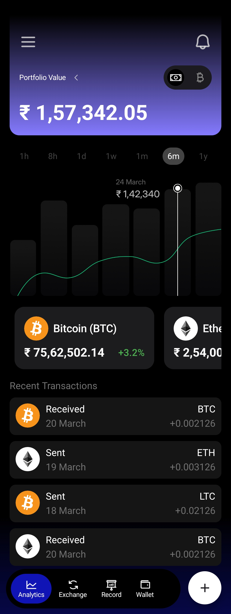
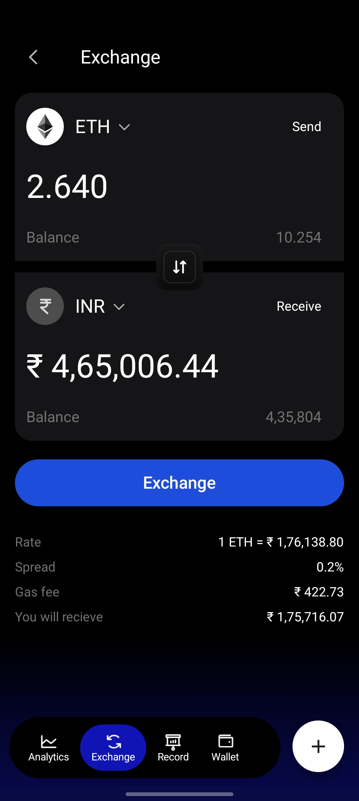
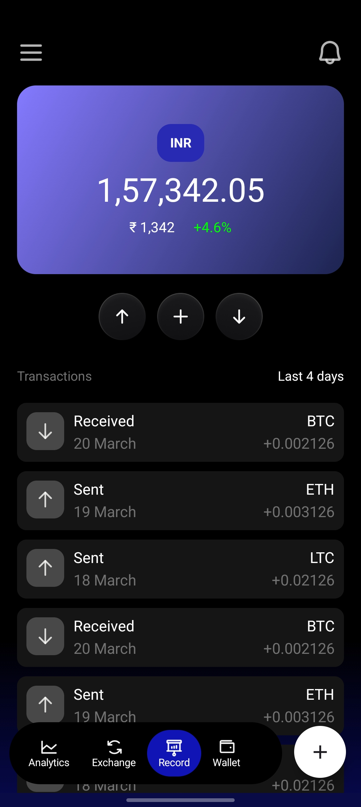

# 💹 Cryp2 – Modern Crypto App UI 💻🌙

**Cryp2** is a sleek and minimal cryptocurrency app UI designed with **Jetpack Compose**.  
It features a dark-themed interface, smooth navigation, and interactive UI components for an elegant crypto experience.

🚀 **A clean and modern UI for your next crypto app project!**  

---

## ✨ Features

- 🔄 **Currency Change Toggle** – Easily switch between different currency views (e.g., INR / USD) with a smooth toggle animation.
- 📊 **Analytics Screen** – Display crypto trends and statistics with an intuitive layout.
- 🔁 **Exchange Screen** – UI for trading or swapping cryptocurrencies.
- 📜 **Record Screen** – List past transactions in a clear, scrollable view.
- ⬆️ **Floating Bottom Navigation Bar** – A stylish floating nav bar for smooth navigation between screens.
- 🌙 **Dark Mode Design** – Optimized for a clean, eye-friendly interface.
- 📜 **Lazy Columns & Lazy Rows** – Efficient scrolling and data presentation for lists and horizontal content.

---

## 🛠️ Tech Stack

- **Language:** Kotlin  
- **UI Framework:** Jetpack Compose  
- **Architecture:** Stateless UI (UI-only project)  
- **Design Components:** Material 3, Custom Shapes & Colors  
- **Navigation:** Jetpack Compose Navigation  

---

## 📸 Screenshots

| Analytics Screen | Exchange Screen | Record Screen |
|------------------|-----------------|---------------|
|  |  |  |

---
